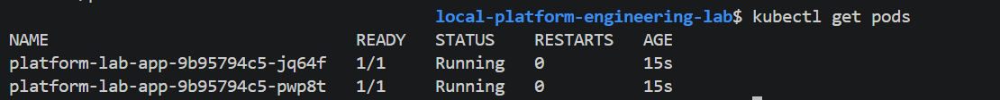
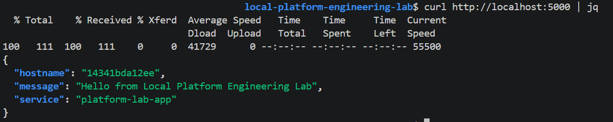
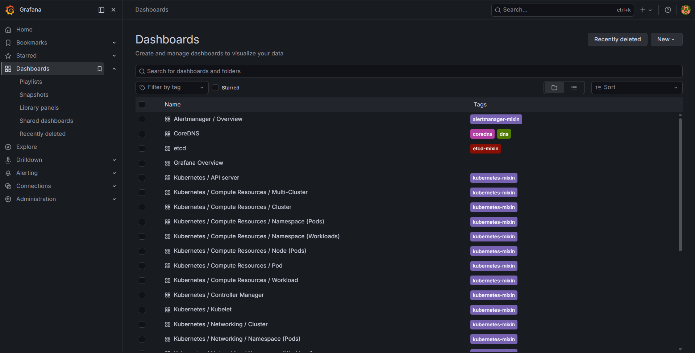

## ⚡ Quick Overview


This is a fully local **Platform Engineering & DevOps lab** that simulates a cloud-native environment without relying on cloud providers or paid services.

It demonstrates how modern platforms are built using:

* Kubernetes-based deployment
* Infrastructure as Code concepts
* CI/CD pipelines
* Observability and monitoring

👉 Run locally and deploy to Kubernetes to simulate real-world workflows.


## 🧠 What This Project Demonstrates

* Containerised application deployment (Docker)
* Local Kubernetes cluster using Kind
* CI/CD pipelines using GitHub Actions
* Versioned Docker builds (release pipeline)
* Observability using Prometheus & Grafana
* Platform engineering practices applied locally


## 🧰 Tech Stack

* Python (Flask)
* Docker
* Kubernetes (Kind)
* GitHub Actions
* Helm
* Prometheus & Grafana


## 🏗️ Architecture Overview

```text
GitHub → CI Pipeline → Docker Image → Kubernetes (Kind) → Application → Monitoring
```


## 📁 Project Structure

```bash
local-platform-engineering-lab/
│
├── app/
├── docker/
├── k8s/
│   ├── deployment.yaml
│   ├── service.yaml
│   ├── kind-cluster.yaml
│
├── monitoring/
│
├── .github/workflows/
│   ├── ci.yml
│   ├── release.yml
│
├── screenshots/
│
└── README.md
```


## ⚙️ Prerequisites

Install:

* Docker
* kubectl
* Kind
* Git
* Helm


# 🚀 Run the Application Locally

Build and run the application:

```bash
docker build -t platform-lab-app:local -f docker/Dockerfile .
docker run -p 5000:5000 platform-lab-app:local
```

Test:

```bash
curl http://localhost:5000
```

# ☸️ Deploy to Kubernetes (Kind)

### 1. Create cluster

```bash
kind create cluster --name platform-lab --config k8s/kind-cluster.yaml
```

### 2. Load Docker image

```bash
kind load docker-image platform-lab-app:local --name platform-lab
```

### 3. Deploy application

```bash
kubectl apply -f k8s/deployment.yaml
kubectl apply -f k8s/service.yaml
```

### 4. Verify deployment

```bash
kubectl get pods
kubectl get svc
```

### 5. Access application

```bash
curl http://localhost:8080
```

# 📊 Monitoring (Prometheus + Grafana)

### Install monitoring stack

```bash
kubectl create namespace monitoring

helm repo add prometheus-community https://prometheus-community.github.io/helm-charts
helm repo update

helm install monitoring prometheus-community/kube-prometheus-stack \
  --namespace monitoring
```

### Verify monitoring

```bash
kubectl get pods -n monitoring
```

### Access Grafana

```bash
kubectl port-forward -n monitoring svc/monitoring-grafana 3000:80
```

Open:

```
http://localhost:3000
```

Login:

```
admin / <check password from Helm output>
```
For password run `kubectl get secret --namespace monitoring -l app.kubernetes.io/component=admin-secret -o jsonpath="{.items[0].data.admin-password}"`

### Access Prometheus

```bash
kubectl port-forward -n monitoring svc/monitoring-kube-prometheus-prometheus 9090:9090
```

Open:

```
http://localhost:9090
```


# 🔁 CI Pipeline

GitHub Actions pipeline runs on every push.

It validates:

* Python syntax
* Application build
* Docker image build
* Kubernetes manifests


# 📦 Release Pipeline

Triggered using Git tags:

```bash
git tag v1.0.0
git push origin v1.0.0
```

This will:

* Build versioned Docker images
* Tag latest image
* Simulate deployment workflow


# 📸 Screenshots

### Kubernetes Pods



### Running Application



### Grafana Dashboard




# 📚 How to Use This Project

This project can be explored in stages:

### 1. Run locally with Docker

Understand containerised applications

### 2. Deploy to Kubernetes

Learn how services run inside clusters

### 3. Explore CI/CD pipelines

Understand automated builds and deployments

### 4. Add monitoring

Visualise system performance using Grafana


# 🎯 Key Takeaways

* How platform engineering works in practice
* How CI/CD integrates with infrastructure
* How Kubernetes-based systems are deployed
* How observability is built into platforms


# 👤 Author

**Binaya Ghimire**